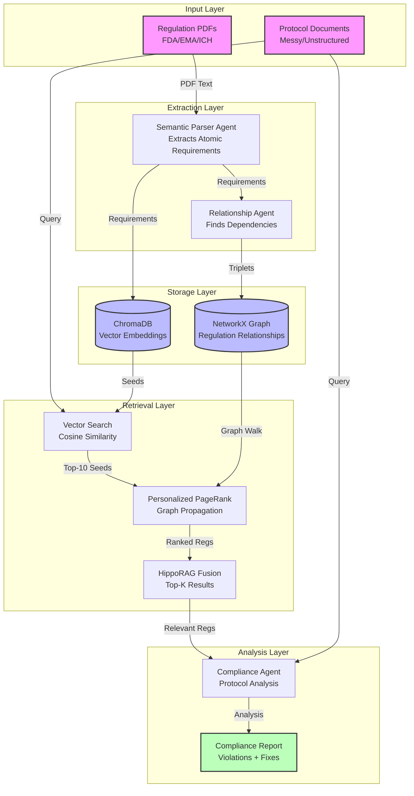
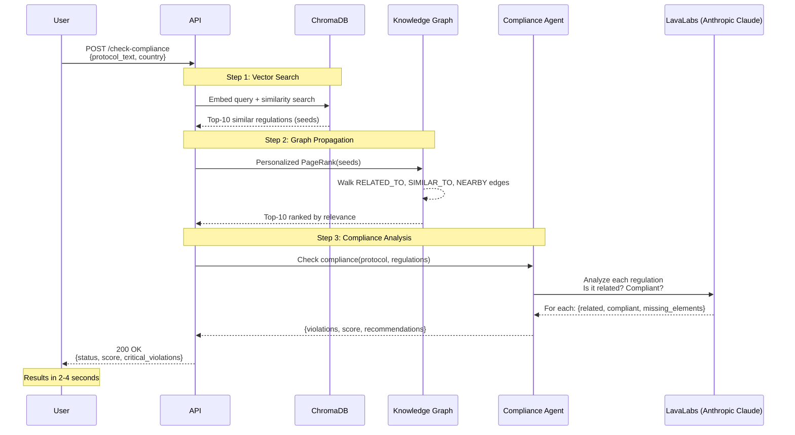

# Harmoniq

**Intelligent Clinical Trial Compliance Platform**

Harmoniq automatically maps regulatory requirements (FDA, EMA) to clinical trial protocols using knowledge graphs and advanced retrieval techniques. When regulations change, instantly identify which protocols, clauses, and studies are impacted—eliminating weeks of manual document review.

---

## 🎯 The Problem

**Current Reality for Clinical Research Organizations (CROs):**

- **160+ days lost** when FDA/EMA regulations change
- **Manual review** of hundreds of pages across thousands of protocol versions
- **Weeks of work** to find which trial clauses are impacted by new rules
- **Traditional vector search fails** to capture relationships between regulations
- **Unstructured, messy documents** with inconsistent formatting
- Each delay costs **$6M+ per day** in lost drug development time

**Example Scenario:**
```
FDA updates 21 CFR Part 50 (Informed Consent requirements)
↓
Which protocols are affected?
Which countries need updates?
Which clauses need revision?
Which trials are at risk?
```

Current solutions require **weeks of manual auditing**. Harmoniq provides answers **in seconds**.

---

## 💡 The Solution

Harmoniq uses **Knowledge Graphs + HippoRAG** to:

1. **Extract atomic requirements** from messy, unstructured regulation PDFs
2. **Build semantic relationship graphs** between requirements (LLM-powered)
3. **Retrieve relevant regulations** using hybrid vector + graph search (Personalized PageRank)
4. **Check protocol compliance** with AI agents that understand regulatory context
5. **Track impact** across documents, studies, and jurisdictions

### Key Innovation: HippoRAG-Inspired Retrieval

Unlike traditional RAG systems that only use vector similarity, Harmoniq combines:

- **Vector Search** (ChromaDB): "What regulations mention similar concepts?"
- **Graph Propagation** (Personalized PageRank): "What else is connected through dependencies?"
- **Agent Analysis**: "Is this protocol actually compliant?"

This finds **indirect relationships** that pure vector search misses.

---

## 🏗️ Architecture

### System Overview



### Compliance Checking Flow



---

## 🔬 How It Works

### 1. **Regulation Ingestion** (One-Time Setup)

```python
# Upload FDA regulation PDF
POST /api/regulations/upload
{
  "file": "21-CFR-Part-50.pdf",
  "country": "USA",
  "authority": "FDA"
}
```

**What happens:**
1. Extract text from PDF (pypdf)
2. Chunk into semantic paragraphs (~1500 chars)
3. Agent extracts **atomic requirements** from messy text
   - "Sponsors must not promote investigational drugs"
   - "IRB must review protocols before initiation"
4. Generate embeddings (sentence-transformers)
5. Store in ChromaDB with metadata
6. Agent extracts **semantic relationships**
   - REQ-001 RELATED_TO REQ-005 (both about consent)
   - REQ-003 RELATED_TO REQ-007 (both about data integrity)
7. Build knowledge graph with 3 edge types:
   - `RELATED_TO` (LLM-extracted semantic relationships)
   - `SIMILAR_TO` (embedding cosine similarity > 0.75)
   - `NEARBY` (sequential chunks, ±1 neighbor)
8. Save graph to disk (persistent NetworkX)

**Result:** 179 regulation nodes, 431 relationship edges

---

### 2. **Protocol Compliance Check** (Real-Time Query)

```python
POST /api/regulations/check-compliance
{
  "protocol_paragraph": "All participants will provide written informed consent...",
  "country": "USA",
  "top_k": 10
}
```

**What happens:**

#### Phase 1: HippoRAG Retrieval (~400ms)
1. Embed protocol text → vector
2. ChromaDB finds top-10 most similar regulations
3. Use these as **seed nodes** for graph walk
4. Run **Personalized PageRank** on knowledge graph
   - Spreads relevance through edges
   - Finds indirectly related regulations
5. Return top-K ranked by PPR score

#### Phase 2: Compliance Analysis (~2-4s)
1. Send protocol + retrieved regulations to agent
2. LLM analyzes each regulation:
   - Is it actually related to this protocol text?
   - If related, does protocol comply?
   - What's missing to achieve compliance?
3. Filter to only related regulations
4. Calculate weighted compliance score
5. Identify critical violations

**Response:**
```json
{
  "status": "NON_COMPLIANT",
  "overall_compliance_score": 0.161,
  "related_regulations": 4,
  "compliant_count": 1,
  "non_compliant_count": 3,
  "critical_violations": [
    {
      "regulation_id": "FDA-CHUNK16-REQ-004",
      "explanation": "Protocol does not specify all §50.25 consent requirements",
      "missing_elements": ["voluntary participation", "withdrawal rights"]
    }
  ],
  "recommendations": [
    ["voluntary participation statement"],
    ["withdrawal rights"]
  ]
}
```

---

## 🧠 Key Technologies

| Component | Technology | Purpose |
|-----------|-----------|---------|
| **Backend API** | FastAPI + Uvicorn | RESTful endpoints, async processing |
| **Vector Database** | ChromaDB | Embedding storage + similarity search |
| **Knowledge Graph** | NetworkX (persistent) | Regulation relationships + PageRank |
| **Embeddings** | sentence-transformers | Semantic text representation |
| **LLM Agent** | LavaLabs (Anthropic Claude) | Semantic extraction + compliance analysis |
| **PDF Parsing** | pypdf | Regulation text extraction |
| **Graph Algorithm** | Personalized PageRank | HippoRAG-style retrieval |

---

## 📊 Performance

**Current System (USA Regulations):**
- **179 requirements** extracted from 3 FDA regulations
- **431 relationships** in knowledge graph
- **~2.5 seconds** end-to-end compliance check
  - 50ms: Embedding
  - 100ms: Vector search
  - 200ms: PageRank
  - 2-4s: LLM analysis
- **Handles messy, unstructured PDFs** with no manual cleanup

**Scalability:**
- Graph algorithms: O(n log n) for PageRank
- Vector search: O(1) with approximate nearest neighbors
- Can handle thousands of regulations per jurisdiction
- Persistent storage (no re-ingestion needed)

---

## 🚀 Getting Started

### Prerequisites
```bash
python 3.12+
poetry (Python dependency manager)
```

### Installation
```bash
# Clone repository
git clone https://github.com/yourusername/harmoniq.git
cd harmoniq/backend-fastapi

# Install dependencies
poetry install

# Set up environment variables
cp .env.example .env
# Add your LavaLabs API key
```

### Configuration
Edit `.env`:
```bash
LAVA_API_KEY=your-lava-api-key-here
ANTHROPIC_MODEL=claude-3-5-sonnet-20240620
ANTHROPIC_VERSION=2023-06-01
```

### Run Server
```bash
poetry run uvicorn app.main:app --reload
```

API available at: `http://localhost:8000`
Interactive docs: `http://localhost:8000/docs`

---

## 📖 Usage Examples

### 1. Ingest FDA Regulations
```bash
curl -X POST http://localhost:8000/api/regulations/upload \
  -F "file=@21-CFR-Part-50.pdf" \
  -F "country=USA" \
  -F "authority=FDA" \
  -F "regulation_id=FDA-Part50-2024"
```

### 2. Check Protocol Compliance
```bash
curl -X POST http://localhost:8000/api/regulations/check-compliance \
  -H "Content-Type: application/json" \
  -d '{
    "protocol_paragraph": "All participants will provide written informed consent before enrollment. The consent form will explain the study purpose, procedures, risks, and benefits.",
    "country": "USA",
    "top_k": 10
  }'
```

### 3. Retrieve Relevant Regulations (HippoRAG)
```bash
curl -X POST http://localhost:8000/api/regulations/retrieve \
  -H "Content-Type: application/json" \
  -d '{
    "query_text": "What are the requirements for informed consent?",
    "country": "USA",
    "top_k": 5
  }'
```

---

## 🎯 Use Cases

### 1. **Regulatory Change Impact Analysis**
**Scenario:** FDA updates informed consent requirements  
**Solution:** Query all protocols → find impacted clauses → generate revision list

### 2. **Protocol Compliance Audit**
**Scenario:** Before trial submission, check if protocol meets all FDA requirements  
**Solution:** Upload protocol → run compliance check → get violation report with fixes

### 3. **Cross-Jurisdiction Compliance**
**Scenario:** Same trial in USA + EU → check against FDA + EMA regulations  
**Solution:** Multiple compliance checks → identify jurisdiction-specific gaps

### 4. **Protocol Drafting Assistant**
**Scenario:** Writing new protocol section on data monitoring  
**Solution:** Query relevant regulations → get checklist of required elements

---

## 🛠️ Technical Details

### Knowledge Graph Structure

**Nodes:**
- Atomic regulatory requirements
- Metadata: severity (critical/high/medium), section, text, country

**Edges:**
- `RELATED_TO`: LLM-extracted semantic relationships (confidence weighted)
- `SIMILAR_TO`: Embedding cosine similarity > 0.75
- `NEARBY`: Sequential document structure (±1 neighbor)

### Agent System

**1. Semantic Parser Agent**
- Extracts 10-20 atomic requirements per chunk
- Identifies topic, severity, requirement type
- Handles messy/unstructured text

**2. Relationship Extraction Agent**
- Processes requirements in batches of 30
- Finds semantic relationships (not just keyword matching)
- Generates confidence scores

**3. Compliance Analysis Agent**
- Determines if regulations are actually related
- Checks compliance with tolerant criteria
- Provides actionable remediation steps

### Why HippoRAG?

Traditional RAG:
```
Query → Vector Search → Return top-K
❌ Misses indirect relationships
❌ Keyword-dependent
```

HippoRAG:
```
Query → Vector Search (seeds) → PageRank (graph walk) → Return top-K
✅ Finds indirect dependencies
✅ Understands semantic structure
✅ Better recall for complex queries
```

---

## 📈 Roadmap

- [ ] Multi-jurisdiction support (EMA, PMDA, Health Canada)
- [ ] Full protocol document parsing (not just paragraphs)
- [ ] Change detection (diff between regulation versions)
- [ ] Impact propagation (regulation → protocols → studies → sites)
- [ ] Frontend UI for visual graph exploration
- [ ] Real-time monitoring of regulatory updates
- [ ] Integration with clinical trial management systems

---

## 📄 License

MIT License - See LICENSE file for details

---

## 🤝 Contributing

Contributions welcome! This project aims to make clinical trial compliance faster and more accurate.

**Areas of interest:**
- Additional regulation parsers (EMA, ICH guidelines)
- Graph visualization tools
- Performance optimization for large document sets
- Integration with pharma document management systems

---

## 📧 Contact

For questions or collaboration opportunities:
- **Email:** vardhan@harmoniq.ai
- **Project:** Intelligent Clinical Trial Compliance Platform

---

**Built with ❤️ for clinical research teams fighting to bring life-saving drugs to market faster.**

