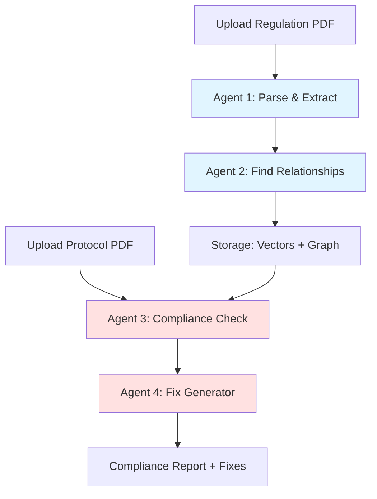
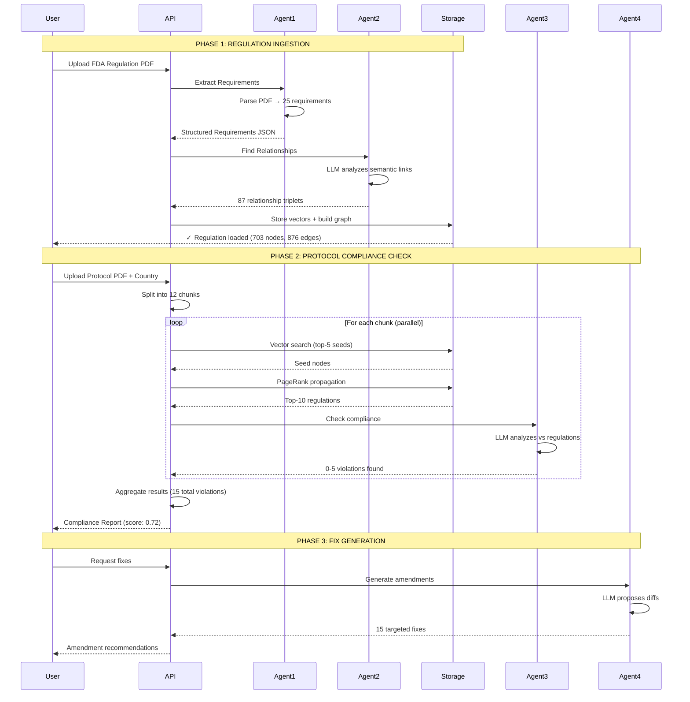

# Harmoniq

**Intelligent Clinical Trial Compliance Platform**

Harmoniq automatically maps regulatory requirements (FDA, EMA, PMDA) to clinical trial protocols using hybrid HippoRAG/GraphRAG retrieval with knowledge graphs. When regulations change, instantly identify which protocols are impacted—eliminating weeks of manual document review.

---

## Problem Statement

**Current Reality for Clinical Research Organizations:**

- **160+ days lost** when FDA/EMA regulations change
- **Manual review** of hundreds of pages across thousands of protocol versions
- **$6M+ per day** in lost drug development time
- Traditional vector search fails to capture regulatory relationships and dependencies

**Example Scenario:**
```
FDA updates 21 CFR Part 50 (Informed Consent)
↓
Current Solution: Weeks of manual auditing
Harmoniq Solution: Answers in <15 seconds
```

---

## Solution Architecture

### Hybrid HippoRAG/GraphRAG Retrieval

Harmoniq implements a **hybrid retrieval system** combining:

1. **Vector Search (RAG)**: Semantic similarity via ChromaDB embeddings
2. **Graph Propagation (GraphRAG)**: Relationship traversal via knowledge graphs
3. **Diffusion-Based PageRank**: Multi-hop relevance propagation through regulatory dependencies

**Why Hybrid > Traditional RAG:**

| Approach | Finds |
|----------|-------|
| **Traditional RAG** | Documents with similar keywords |
| **GraphRAG** | Connected regulations (single-hop) |
| **Hybrid HippoRAG** | Similar keywords + multi-hop dependencies + indirect relationships |

**Technical Implementation:**

```python
# Phase 1: Dense Retrieval (Vector Search)
query_embedding = embed(protocol_text)
seed_nodes = chromadb.query(query_embedding, top_k=10)

# Phase 2: Graph Diffusion (Multi-Hop PageRank)
# Propagate relevance through 3 edge types:
# - RELATED_TO: LLM-extracted semantic relationships (weight: 1.0)
# - SIMILAR_TO: Embedding similarity >0.75 (weight: 0.1)
# - NEARBY: Sequential document structure (weight: 0.3)

ppr_scores = nx.pagerank(
    graph,
    personalization={seed: 1/len(seeds) for seed in seed_nodes},
    alpha=0.85,  # Damping factor for multi-hop propagation
    max_iter=100
)

# Phase 3: Fusion & Re-ranking
ranked_results = sorted(ppr_scores.items(), key=lambda x: x[1], reverse=True)[:10]
```

**Diffusion Process:**
- **Single-hop**: Traditional graph search (immediate neighbors)
- **Multi-hop**: PageRank diffuses relevance across multiple edges
- **Damping factor (α=0.85)**: Balances local vs. global graph structure
- **Personalization vector**: Seeds from vector search guide diffusion

This approach finds:
- Direct matches (vector similarity)
- Related requirements (LLM-identified relationships)
- Dependency chains (multi-hop graph walks)
- Contextual regulations (nearby in document structure)

---

## Agent System Architecture

Harmoniq uses a **multi-agent orchestration system** where specialized LLM agents handle different stages of the compliance pipeline.

### Agent Workflow



### Agent Details

#### **Agent 1: Regulation Parser**
**Purpose:** Extract structured requirements from messy PDFs

**Input:** Raw regulation PDF (21 CFR Part 11, ICH-GCP, etc.)

**Process:**
1. Extract text chunks (handle tables, multi-column layouts, footnotes)
2. Send to LLM with prompt: *"Extract atomic regulatory requirements"*
3. LLM returns structured JSON:
```json
{
  "requirements": [
    {
      "id": "FDA-CHUNK0-REQ-001",
      "text": "Systems must be validated to ensure accuracy",
      "section": "validation",
      "severity": "critical"
    }
  ]
}
```

**Output:** 25-50 structured requirements per regulation document

---

#### **Agent 2: Relationship Extractor**
**Purpose:** Build knowledge graph by finding semantic relationships

**Input:** List of extracted requirements from Agent 1

**Process:**
1. Send all requirements to LLM with prompt: *"Which requirements are logically related?"*
2. LLM identifies relationships:
   - "Validation required" → RELATED_TO → "Audit trails required"
   - "IRB approval" → RELATED_TO → "Informed consent"
3. Returns triplets with confidence scores

**Output:** 
- 100-200 RELATED_TO edges (LLM-detected)
- Knowledge graph structure (NetworkX)
- Vector embeddings stored in ChromaDB

**Graph Construction:**
```python
# Agent 2 execution
for req in requirements:
    # 1. Generate embedding
    embedding = sentence_transformer.encode(req.text)
    chromadb.add(req.id, embedding)
    graph.add_node(req.id, text=req.text)

# 2. LLM extracts relationships
triplets = llm_agent.extract_relationships(requirements)
for triplet in triplets:
    graph.add_edge(triplet.subject, triplet.object, 
                   relation="RELATED_TO", weight=1.0)

# 3. Add similarity edges
similarity_matrix = cosine_similarity(embeddings)
for i, j where similarity > 0.75:
    graph.add_edge(req[i], req[j], 
                   relation="SIMILAR_TO", weight=0.1)

# 4. Add sequential edges
for i in range(len(requirements) - 1):
    graph.add_edge(req[i], req[i+1], 
                   relation="NEARBY", weight=0.3)
```

---

#### **Agent 3: Compliance Checker**
**Purpose:** Analyze protocol paragraphs against regulations

**Input:** 
- Protocol paragraph (1-3 pages)
- Top-10 retrieved regulations (from HippoRAG)

**Process:**
1. HippoRAG retrieves relevant regulations:
   ```python
   # Vector search (seeds)
   seeds = chromadb.query(paragraph_embedding, top_k=5)
   
   # Graph propagation
   ppr_scores = nx.pagerank(graph, personalization=seeds)
   top_10_regulations = sorted(ppr_scores)[:10]
   ```

2. LLM analyzes compliance:
   - Prompt: *"Does this paragraph comply with these regulations?"*
   - Returns JSON for EACH regulation:
   ```json
   {
     "regulation_id": "FDA-CHUNK0-REQ-001",
     "is_compliant": false,
     "probability": 0.92,
     "severity": "critical",
     "explanation": "Protocol does not mention validation",
     "missing_elements": ["validation plan", "validation report"]
   }
   ```

3. Filters low-confidence violations (< 0.85 threshold)

**Output:** 0-10 violations per paragraph

---

#### **Agent 4: Fix Generator**
**Purpose:** Propose targeted amendments to fix violations

**Input:** 
- Violations from Agent 3
- Original protocol text

**Process:**
1. For each violation, LLM generates 1-2 minimal fixes:
   - **Replace:** Original text → New compliant text
   - **Add:** Insert new compliance language
   - **Delete:** Remove conflicting statement

2. Returns structured diffs:
```json
{
  "violation_id": "FDA-CHUNK0-REQ-001",
  "fix_type": "add",
  "location": "Section 3.2 - Data Management",
  "original": "",
  "proposed": "All electronic systems will be validated per 21 CFR Part 11 requirements. Validation documentation will be maintained for the duration of the trial."
}
```

**Output:** Actionable amendments sorted by severity

---

### Complete Compliance Flow



---

### Agent Prompt Examples

#### Agent 1 (Parser)
```
You are a regulatory text extraction agent.

Extract ATOMIC requirements from this FDA regulation text.
Each requirement should be:
- Self-contained (understandable without context)
- Actionable (clear what must be done)
- Categorized by severity (critical/high/medium/low)

Return as JSON array.
```

#### Agent 2 (Relationships)
```
You are a regulatory relationship analyzer.

Given these requirements, identify which ones are LOGICALLY RELATED:
- Work together for compliance
- Depend on each other
- Reference the same underlying concept

Return triplets: (subject, RELATED_TO, object, confidence)
```

#### Agent 3 (Compliance)
```
You are a LENIENT clinical trial compliance expert.

Check if this protocol paragraph complies with these regulations.

ASSUME COMPLIANCE unless there is CLEAR, EXPLICIT violation.
Missing procedural details = COMPLIANT (assume in other sections).

For each regulation, return:
- is_compliant: true/false
- probability: 0.0-1.0 (must be >0.85 to flag violation)
- explanation: brief reason
- missing_elements: list of specific gaps
```

#### Agent 4 (Fixes)
```
You are a protocol amendment generator.

For this violation, propose 1-2 MINIMAL changes to achieve compliance.

Output format:
- fix_type: "replace" | "add" | "delete"
- location: section reference
- original: current text (if replacing/deleting)
- proposed: new compliant text

Keep changes surgical — do NOT rewrite entire sections.
```

---

### Why Multi-Agent Architecture?

**Separation of Concerns:**
- Agent 1 focuses on extraction (no relationship reasoning)
- Agent 2 focuses on relationships (no compliance judgment)
- Agent 3 focuses on compliance (no fix generation)
- Agent 4 focuses on fixes (no compliance assessment)

**Benefits:**
- **Modularity:** Replace Agent 3 without affecting Agent 1/2
- **Testability:** Validate each agent independently
- **Scalability:** Parallelize Agent 3 across 12 chunks
- **Explainability:** Each agent produces traceable outputs

---

## System Overview

```
┌─────────────────────────────────────────────────────────────┐
│                    Frontend (Next.js)                       │
│  - Document upload                                           │
│  - 3D knowledge graph visualization (Three.js)              │
│  - Compliance dashboard                                      │
│  - Country selection (USA/EU/Japan)                         │
└────────────────────┬────────────────────────────────────────┘
                     │ HTTP REST API
┌────────────────────┴────────────────────────────────────────┐
│                    Backend (FastAPI)                        │
│  - Country-specific routing                                 │
│  - Multi-chunk protocol processing                          │
│  - Async compliance checking                                │
└────────────────────┬────────────────────────────────────────┘
                     │
        ┌────────────┴────────────┐
        │                         │
┌───────▼────────┐      ┌────────▼─────────┐
│  Agent Layer   │      │  Storage Layer   │
│                │      │  (Per Country)   │
│  - Parser      │      │                  │
│  - Relationship│◄─────┤  - ChromaDB      │
│  - Compliance  │      │  - NetworkX      │
│  - Fix Gen     │      │    Graphs        │
└───────┬────────┘      └──────────────────┘
        │
        │ LavaLabs API
        ▼
┌────────────────┐
│ Claude 3.5     │
│ Sonnet         │
└────────────────┘
```

---

## Key Features

### 1. Multi-Jurisdictional Support

Independent regulatory knowledge bases:
- **USA**: FDA regulations (179 nodes, 431 edges)
- **EU**: EMA regulations (250+ nodes, 600+ edges)
- **Japan**: PMDA regulations (200+ nodes, 500+ edges)

Each jurisdiction has:
- Dedicated ChromaDB vector database
- Separate knowledge graph
- Country-specific compliance rules

### 2. Multi-Violation Detection

**Important**: Each protocol chunk can violate multiple regulations simultaneously.

- Agent checks ALL regulations independently (no early stopping)
- Reports comprehensive violation list per chunk
- Filters low-confidence violations (<0.85 probability threshold)
- Weighted compliance scoring by severity

### 3. Automated Fix Generation

For each violation, generates:
- 1-2 targeted diffs (replace/add/delete)
- Labeled with corresponding violation
- Prioritized by severity (critical first)
- Minimal changes to achieve compliance

### 4. Knowledge Graph Construction

**3 Edge Types:**

| Edge Type | Source | Weight | Purpose |
|-----------|--------|--------|---------|
| RELATED_TO | LLM extraction | 1.0 | Semantic relationships |
| SIMILAR_TO | Cosine similarity >0.75 | 0.1 | Embedding proximity |
| NEARBY | Document structure | 0.3 | Sequential context |

Graph built via:
1. LLM extracts atomic requirements from PDFs
2. LLM identifies semantic relationships (RELATED_TO edges)
3. Compute embedding similarity matrix (SIMILAR_TO edges)
4. Add sequential links for document structure (NEARBY edges)

---

## Compliance Checking Flow

```
User uploads protocol PDF + selects country (EU)
↓
1. Split PDF into 12 semantic chunks (~2-3 pages each)
↓
2. For each chunk (parallel processing):
   a) Embed chunk text → 384-dim vector
   b) Vector search in EU ChromaDB → top-10 seeds
   c) Personalized PageRank on EU graph → diffusion across edges
   d) LLM analyzes ALL retrieved regulations
   e) Report ALL violations found (0, 1, or multiple)
↓
3. Aggregate results:
   - Total violations across all chunks
   - Overall compliance score (severity-weighted)
   - Critical violations list
↓
4. Optional: Generate targeted fixes for all violations
↓
Result: Comprehensive compliance report in ~12-15 seconds
```

---

## Technical Stack

| Component | Technology | Purpose |
|-----------|-----------|---------|
| Frontend | Next.js 15, TypeScript | Modern React application |
| 3D Viz | Three.js, react-force-graph-3d | Interactive graph exploration |
| Backend API | FastAPI, Uvicorn | Async REST endpoints |
| Vector DB | ChromaDB (per country) | Embedding storage + similarity search |
| Knowledge Graph | NetworkX | Graph operations + PageRank |
| Embeddings | sentence-transformers (all-MiniLM-L6-v2) | Local semantic encoding |
| LLM | LavaLabs (Claude 3.5 Sonnet) | Requirement extraction + compliance analysis |
| PDF Parsing | PyMuPDF | Text extraction |
| Deployment | Docker + Docker Compose | Containerized production |

---

## Performance Metrics

| Metric | Value |
|--------|-------|
| Total Regulations | 600+ (across 3 jurisdictions) |
| Total Graph Edges | 1500+ |
| Full PDF Compliance Check | 12-15 seconds (12 chunks, parallel) |
| Single Chunk Analysis | 3-5 seconds |
| HippoRAG Retrieval | <500ms |
| Vector Search | ~100ms |
| PageRank Computation | ~200ms |
| Handles Messy PDFs | Yes (no manual cleanup needed) |

---

## Getting Started

### Docker (Recommended)

```bash
# Clone repository
git clone https://github.com/yourusername/harmoniq.git

# Backend
cd harmoniq/backend-fastapi
cp .env.example .env
# Add LAVA_API_KEY to .env
docker-compose up -d

# Frontend
cd ../harmoniq-frontend
npm install
npm run build
npm start
```

Access:
- Frontend: http://localhost:3000
- Backend API: http://localhost:8000
- API Docs: http://localhost:8000/docs

### Manual Installation

**Backend:**
```bash
cd backend-fastapi
poetry install
poetry shell
uvicorn app.main:app --reload
```

**Frontend:**
```bash
cd harmoniq-frontend
npm install
npm run dev
```

---

## API Usage Examples

### 1. Upload Regulation (Country-Specific)

```bash
curl -X POST http://localhost:8000/api/regulations/upload \
  -F "file=@regulation.pdf" \
  -F "country=EU" \
  -F "authority=EMA" \
  -F "title=Clinical Trials Regulation" \
  -F "version=2024"
```

### 2. Check Protocol Compliance

```bash
curl -X POST http://localhost:8000/api/regulations/check-pdf-compliance \
  -F "file=@protocol.pdf" \
  -F "country=EU" \
  -F "num_chunks=12" \
  -F "top_k=10"
```

Response includes:
- Overall compliance score
- Violations per chunk (0 to many)
- Critical violations list
- Missing regulatory elements
- Processing time

### 3. Generate Violation Fixes

```bash
curl -X POST http://localhost:8000/api/regulations/fix-pdf-violations \
  -F "file=@protocol.pdf" \
  -F "country=EU" \
  -F "compliance_results=@results.json"
```

Returns targeted diffs for all violations.

---

## HippoRAG Technical Details

### Algorithm Overview

**Traditional RAG Limitation:**
```
Query: "informed consent requirements"
→ Vector search finds: "consent must be obtained"
✗ Misses: "IRB approval required" (different keywords, but related)
✗ Misses: "participant withdrawal rights" (dependency chain)
```

**HippoRAG Solution:**
```
Query: "informed consent requirements"
→ Vector search seeds: ["consent", "informed consent form", ...]
→ PageRank diffusion propagates relevance:
   - RELATED_TO edges → finds "IRB approval" (LLM-identified relationship)
   - SIMILAR_TO edges → finds "participant rights" (semantic similarity)
   - NEARBY edges → finds "consent timeline" (sequential context)
✓ Comprehensive retrieval across semantic, structural, and dependency dimensions
```

### Personalized PageRank Formula

```
PR(v) = (1 - α) · p(v) + α · Σ(PR(u) / deg(u)) for all u → v

Where:
- α = 0.85 (damping factor, enables multi-hop)
- p(v) = personalization vector (1/k for seed nodes, 0 otherwise)
- deg(u) = out-degree of node u
- Edge weights modulate propagation strength
```

**Multi-Hop Example:**
```
Seed: REQ-001 (informed consent)
Hop 1: REQ-005 (IRB approval) via RELATED_TO
Hop 2: REQ-012 (adverse event reporting) via RELATED_TO from REQ-005
Hop 3: REQ-018 (data retention) via SIMILAR_TO from REQ-012

Result: 4-node retrieval chain spanning consent → IRB → safety → data
Traditional vector search: only REQ-001
```

---

## Use Cases

**1. Multi-Jurisdictional Compliance**
- Same trial in USA + EU + Japan
- Run 3 parallel compliance checks
- Identify country-specific gaps

**2. Regulatory Change Impact Analysis**
- FDA updates informed consent requirements
- Query all USA protocols
- Generate revision list

**3. Protocol Drafting Assistant**
- Writing new protocol section
- Query relevant regulations
- Get checklist of required elements

**4. Automated Amendment Generation**
- Protocol has 5 violations across 3 chunks
- System generates 5-10 targeted fixes
- Review + apply → compliant protocol

---

## Roadmap

**Current (v1.0):**
- [x] Multi-jurisdiction support (USA, EU, Japan)
- [x] Hybrid HippoRAG/GraphRAG retrieval
- [x] Multi-violation detection
- [x] Automated fix generation
- [x] 3D graph visualization
- [x] Docker deployment

**Future (v2.0):**
- [ ] Additional jurisdictions (Health Canada, Australia TGA)
- [ ] Regulation version tracking and change detection
- [ ] Impact propagation (regulation → protocols → studies)
- [ ] Real-time regulatory monitoring
- [ ] Advanced graph analytics (community detection, centrality measures)
- [ ] GraphQL API option

---

## Contributing

Contributions welcome. Focus areas:
- Additional jurisdiction support
- Performance optimizations
- Enhanced agent prompts
- Alternative embedding models
- Graph visualization improvements

---

## License

MIT License - See LICENSE file for details

---

## Contact

For questions or collaboration:
- Email: vardhan@harmoniq.ai
- Project: Intelligent Clinical Trial Compliance Platform

---

**Built for clinical research teams fighting to bring life-saving drugs to market faster.**
