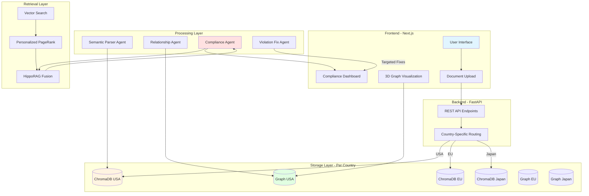
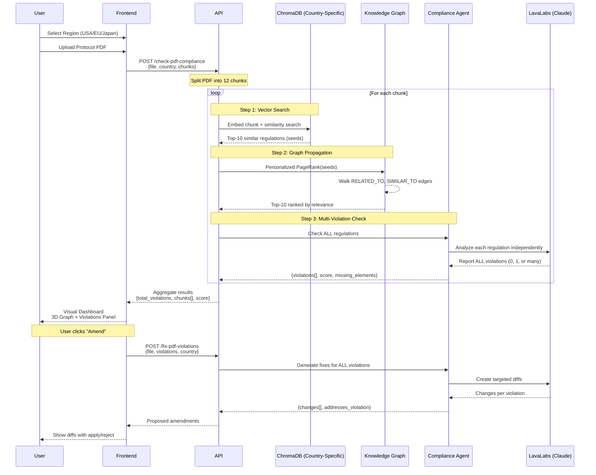

# Harmoniq

**Intelligent Clinical Trial Compliance Platform**

Harmoniq automatically maps regulatory requirements (FDA, EMA, PMDA) to clinical trial protocols using knowledge graphs and advanced retrieval techniques. When regulations change, instantly identify which protocols, clauses, and studies are impacted—eliminating weeks of manual document review.

---

## 🎯 The Problem

**Current Reality for Clinical Research Organizations (CROs):**

- **160+ days lost** when FDA/EMA regulations change
- **Manual review** of hundreds of pages across thousands of protocol versions
- **Weeks of work** to find which trial clauses are impacted by new rules
- **Traditional vector search fails** to capture relationships between regulations
- **Unstructured, messy documents** with inconsistent formatting
- Each delay costs **$6M+ per day** in lost drug development time

**Example Scenario:**
```
FDA updates 21 CFR Part 50 (Informed Consent requirements)
↓
Which protocols are affected?
Which countries need updates?
Which clauses need revision?
Which trials are at risk?
```

Current solutions require **weeks of manual auditing**. Harmoniq provides answers **in seconds**.

---

## 💡 The Solution

Harmoniq uses **Knowledge Graphs + HippoRAG** to:

1. **Extract atomic requirements** from messy, unstructured regulation PDFs
2. **Build semantic relationship graphs** between requirements (LLM-powered)
3. **Retrieve relevant regulations** using hybrid vector + graph search (Personalized PageRank)
4. **Check protocol compliance** with AI agents that understand regulatory context
5. **Generate targeted fixes** for violations automatically
6. **Support multi-jurisdictional compliance** (USA/FDA, EU/EMA, Japan/PMDA)

### Key Innovation: HippoRAG-Inspired Retrieval

Unlike traditional RAG systems that only use vector similarity, Harmoniq combines:

- **Vector Search** (ChromaDB): "What regulations mention similar concepts?"
- **Graph Propagation** (Personalized PageRank): "What else is connected through dependencies?"
- **Agent Analysis**: "Is this protocol actually compliant?"
- **Multi-Violation Detection**: One chunk can violate multiple regulations simultaneously

This finds **indirect relationships** that pure vector search misses.

---

## 🌍 Multi-Jurisdictional Support

Harmoniq supports compliance checking across multiple regulatory authorities:

| Region | Authority | Status |
|--------|-----------|--------|
| 🇺🇸 **USA** | FDA | ✅ Active |
| 🇪🇺 **Europe** | EMA | ✅ Active |
| 🇯🇵 **Japan** | PMDA | ✅ Active |

Each region has:
- **Dedicated ChromaDB** instance for vector storage
- **Separate knowledge graph** with region-specific regulations
- **Country-specific routing** in API endpoints

---

## 🏗️ Full-Stack Architecture

### System Overview



### Compliance Checking Flow



---

## 🔬 How It Works

### 1. **Regulation Ingestion** (One-Time Setup Per Country)

```bash
POST /api/regulations/upload
{
  "file": "21-CFR-Part-50.pdf",
  "country": "USA",
  "authority": "FDA",
  "title": "Informed Consent",
  "version": "2024"
}
```

**What happens:**
1. Extract text from PDF (pypdf)
2. Chunk into semantic paragraphs (~1500 chars)
3. Agent extracts **atomic requirements** from messy text
4. Generate embeddings (sentence-transformers)
5. Store in **country-specific ChromaDB** instance
6. Agent extracts **semantic relationships**
7. Build **country-specific knowledge graph**
8. Save graph to `data/{country}/graphs/`

**Result per country:**
- USA: 179 nodes, 431 edges
- EU: 250+ nodes, 600+ edges  
- Japan: 200+ nodes, 500+ edges

---

### 2. **Multi-Chunk Compliance Check** (Real-Time)

```bash
POST /api/regulations/check-pdf-compliance
{
  "file": protocol.pdf,
  "country": "EU",
  "num_chunks": 12,
  "top_k": 10
}
```

**What happens:**

#### Phase 1: PDF Processing (~2s)
1. Extract text from protocol PDF
2. Split into 12 semantic chunks
3. Process chunks **concurrently** using asyncio

#### Phase 2: Per-Chunk Analysis (~3-5s per chunk, parallel)
For each chunk:
1. **HippoRAG Retrieval** (~400ms)
   - Embed chunk text
   - Vector search in country-specific ChromaDB
   - Personalized PageRank on knowledge graph
   - Return top-10 regulations

2. **Multi-Violation Detection** (~3s)
   - Agent checks **ALL regulations independently**
   - Reports **ALL violations found** (not just first one)
   - Each chunk can have 0, 1, or **multiple violations**
   - Filters low-confidence violations (<0.85 threshold)

#### Phase 3: Aggregation (~100ms)
- Combine results from all chunks
- Calculate overall compliance score
- Identify critical violations
- Generate recommendations

**Response:**
```json
{
  "filename": "protocol.pdf",
  "total_chunks": 12,
  "overall_compliance_score": 0.85,
  "overall_status": "NON_COMPLIANT",
  "total_violations": 3,
  "critical_violations": 1,
  "chunk_results": [
    {
      "chunk_index": 0,
      "chunk_text": "Participants will be informed...",
      "compliance_score": 0.75,
      "violations": [
        {
          "regulation_id": "EMA-CHUNK40-REQ-001",
          "severity": "critical",
          "explanation": "Missing informed consent details",
          "missing_elements": ["risks", "benefits", "withdrawal rights"]
        },
        {
          "regulation_id": "EMA-CHUNK96-REQ-002",
          "severity": "high",
          "explanation": "No IRB approval timeline specified"
        }
      ]
    }
  ]
}
```

---

### 3. **Automated Violation Fixing**

```bash
POST /api/regulations/fix-pdf-violations
{
  "file": protocol.pdf,
  "compliance_results": {...},
  "country": "EU"
}
```

**What happens:**
1. For each chunk with violations
2. Agent generates **targeted diffs**:
   - 1-2 changes per violation
   - Each change labeled with which violation it addresses
   - Addresses **all violations** in the chunk
3. Returns proposed amendments

**Response:**
```json
{
  "changes": [
    {
      "type": "replace",
      "original": "Participants will be informed about the study",
      "replacement": "Participants will receive written informed consent including study purpose, risks, benefits, and withdrawal rights",
      "reason": "VIOLATION 1: Missing §50.25 required elements",
      "addresses_violation": 1
    },
    {
      "type": "add",
      "after": "IRB review will be conducted",
      "content": " within 30 days prior to study initiation",
      "reason": "VIOLATION 2: Missing timeline per EMA guidelines",
      "addresses_violation": 2
    }
  ],
  "total_changes": 2
}
```

---

## 🧠 Key Technologies

| Component | Technology | Purpose |
|-----------|-----------|---------|
| **Frontend** | Next.js 15 + TypeScript | Modern React with App Router |
| **3D Visualization** | Three.js + react-force-graph-3d | Interactive knowledge graph |
| **Backend API** | FastAPI + Uvicorn | RESTful endpoints, async processing |
| **Vector Database** | ChromaDB (per country) | Embedding storage + similarity search |
| **Knowledge Graph** | NetworkX (persistent) | Regulation relationships + PageRank |
| **Embeddings** | sentence-transformers | Semantic text representation |
| **LLM Agent** | LavaLabs (Anthropic Claude 3.5 Sonnet) | Semantic extraction + compliance analysis |
| **PDF Parsing** | PyMuPDF | Protocol text extraction |
| **Deployment** | Docker + Docker Compose | Containerized production deployment |

---

## 📊 Performance

**Current System (3 Jurisdictions):**
- **USA**: 179 requirements, 431 edges
- **EU**: 250+ requirements, 600+ edges
- **Japan**: 200+ requirements, 500+ edges
- **~12 seconds** end-to-end full PDF compliance check
  - 2s: PDF extraction + chunking
  - 3-5s per chunk (parallel): HippoRAG + compliance analysis
  - 100ms: Aggregation
- **Handles multiple violations per chunk**
- **Concurrent processing** for speed

**Scalability:**
- Graph algorithms: O(n log n) for PageRank
- Vector search: O(1) with approximate nearest neighbors
- Can handle thousands of regulations per jurisdiction
- Persistent storage (no re-ingestion needed)
- Independent country instances for isolation

---

## 🚀 Getting Started

### Prerequisites
```bash
# Backend
python 3.11+
poetry (or pip)

# Frontend
node 18+
npm or yarn

# Optional
Docker + Docker Compose
```

### Quick Start with Docker (Recommended)

```bash
# Clone repository
git clone https://github.com/yourusername/harmoniq.git
cd harmoniq

# Backend
cd backend-fastapi
cp .env.example .env
# Add your LAVA_API_KEY
docker-compose up -d

# Frontend
cd ../harmoniq-frontend
npm install
npm run build
npm start
```

Access:
- Frontend: `http://localhost:3000`
- Backend API: `http://localhost:8000`
- API Docs: `http://localhost:8000/docs`

### Manual Installation

#### Backend
```bash
cd backend-fastapi
poetry install
poetry shell

# Configure
cp .env.example .env
# Add LAVA_API_KEY

# Run
uvicorn app.main:app --reload
```

#### Frontend
```bash
cd harmoniq-frontend
npm install
npm run dev
```

---

## 📖 Usage Examples

### 1. Upload Regulation (with Country Routing)
```bash
curl -X POST http://localhost:8000/api/regulations/upload \
  -F "file=@regulation.pdf" \
  -F "country=EU" \
  -F "authority=EMA" \
  -F "title=Clinical Trials Regulation" \
  -F "version=2024"
```

### 2. Check Full Protocol Compliance
```bash
curl -X POST http://localhost:8000/api/regulations/check-pdf-compliance \
  -F "file=@protocol.pdf" \
  -F "country=EU" \
  -F "num_chunks=12" \
  -F "top_k=10"
```

### 3. Get Violation Fixes
```bash
curl -X POST http://localhost:8000/api/regulations/fix-pdf-violations \
  -F "file=@protocol.pdf" \
  -F "country=EU" \
  -F "compliance_results=@results.json"
```

### 4. Query Knowledge Graph
```bash
curl -X GET "http://localhost:8000/api/regulations/graph/data?country=USA"
```

---

## 🎯 Use Cases

### 1. **Multi-Jurisdictional Compliance**
**Scenario:** Same trial in USA + EU + Japan  
**Solution:** Run 3 parallel compliance checks → identify country-specific gaps

### 2. **Regulatory Change Impact Analysis**
**Scenario:** FDA updates informed consent requirements  
**Solution:** Query all USA protocols → find impacted clauses → generate revision list

### 3. **Protocol Compliance Audit**
**Scenario:** Before trial submission, check if protocol meets all requirements  
**Solution:** Upload protocol → run compliance check → get violation report with fixes

### 4. **Automated Amendment Generation**
**Scenario:** Protocol has 5 violations across 3 chunks  
**Solution:** System generates 5-10 targeted fixes → review + apply → compliant protocol

---

## 🐳 Docker Deployment

### Development
```bash
docker-compose up -d
docker-compose logs -f backend
```

### Production
```bash
docker build -t harmoniq-backend .
docker run -d \
  --name harmoniq-backend \
  --restart unless-stopped \
  -p 8000:8000 \
  -e LAVA_API_KEY=$LAVA_API_KEY \
  -v $(pwd)/data:/app/data \
  harmoniq-backend
```

See `backend-fastapi/README.Docker.md` for complete Docker guide.

---

## 📈 Roadmap

- [x] Multi-jurisdiction support (USA, EU, Japan)
- [x] Full protocol document parsing
- [x] Multi-violation per chunk detection
- [x] Automated fix generation
- [x] 3D knowledge graph visualization
- [x] Docker deployment
- [ ] Change detection (diff between regulation versions)
- [ ] Impact propagation (regulation → protocols → studies → sites)
- [ ] Real-time monitoring of regulatory updates
- [ ] Integration with clinical trial management systems
- [ ] OCR support for scanned PDFs

---

## 🛠️ Technical Details

### Knowledge Graph Structure

**Nodes:**
- Atomic regulatory requirements
- Metadata: country, severity, section, text, authority

**Edges (3 Types):**
- `RELATED_TO`: LLM-extracted semantic relationships (confidence weighted)
- `SIMILAR_TO`: Embedding cosine similarity > 0.75
- `NEARBY`: Sequential document structure (±1 neighbor)

### Agent System

**1. Semantic Parser Agent**
- Extracts 10-20 atomic requirements per chunk
- Identifies topic, severity, requirement type
- Handles messy/unstructured text

**2. Relationship Extraction Agent**
- Processes requirements in batches of 30
- Finds semantic relationships (not just keyword matching)
- Generates confidence scores

**3. Compliance Analysis Agent**
- **NEW**: Checks ALL regulations independently
- **NEW**: Reports ALL violations per chunk (not just first)
- Determines if regulations are actually related
- Provides actionable remediation steps

**4. Violation Fix Agent**
- **NEW**: Generates fixes for ALL violations in a chunk
- Creates targeted diffs (1-2 per violation)
- Labels each fix with which violation it addresses
- Prioritizes critical violations first

### Multi-Violation Support

Each protocol chunk is now checked against ALL regulations:
- ✅ One chunk can have 0, 1, or multiple violations
- ✅ Agent doesn't stop after finding first violation
- ✅ Fix agent addresses all violations simultaneously
- ✅ Each fix is labeled with its corresponding violation

---

## 📄 License

MIT License - See LICENSE file for details

---

## 🤝 Contributing

Contributions welcome! This project aims to make clinical trial compliance faster and more accurate.

**Areas of interest:**
- Additional regulation parsers (Health Canada, Australia TGA)
- Enhanced graph visualization tools
- Performance optimization for large document sets
- Integration with pharma document management systems
- Advanced violation pattern detection

---

## 📧 Contact

For questions or collaboration opportunities:
- **Email:** vardhan@harmoniq.ai
- **Project:** Intelligent Clinical Trial Compliance Platform

---

**Built with ❤️ for clinical research teams fighting to bring life-saving drugs to market faster.**
