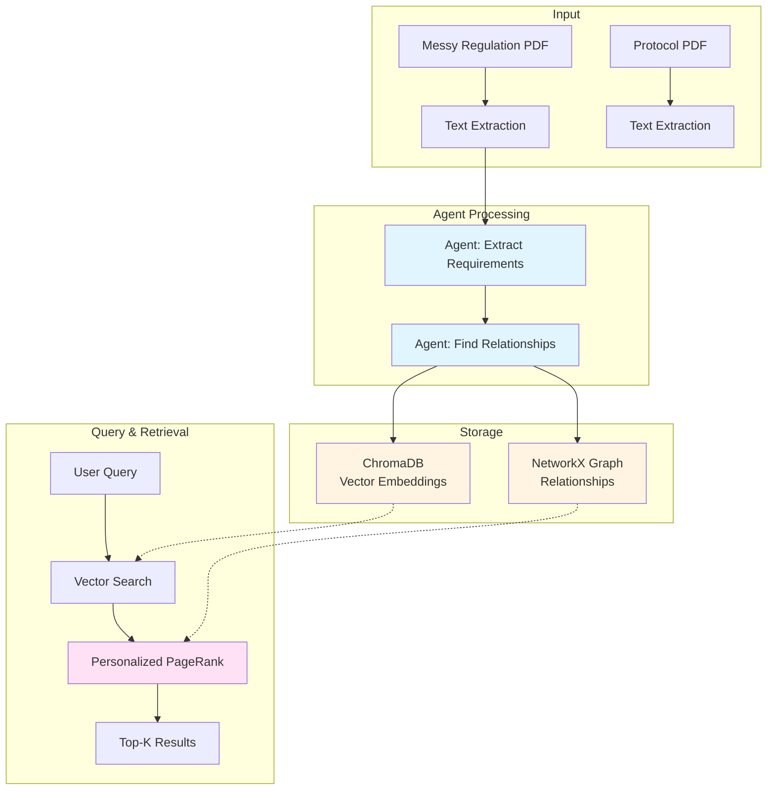
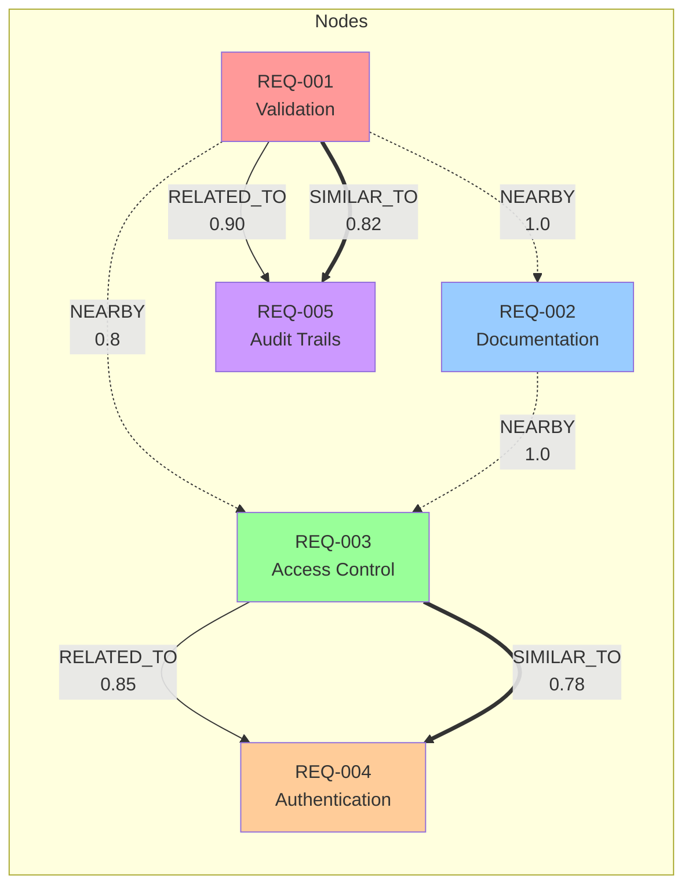
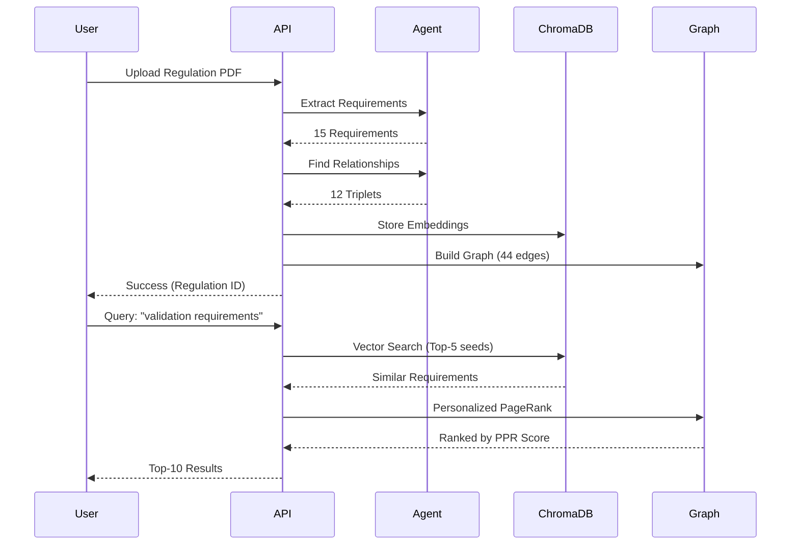
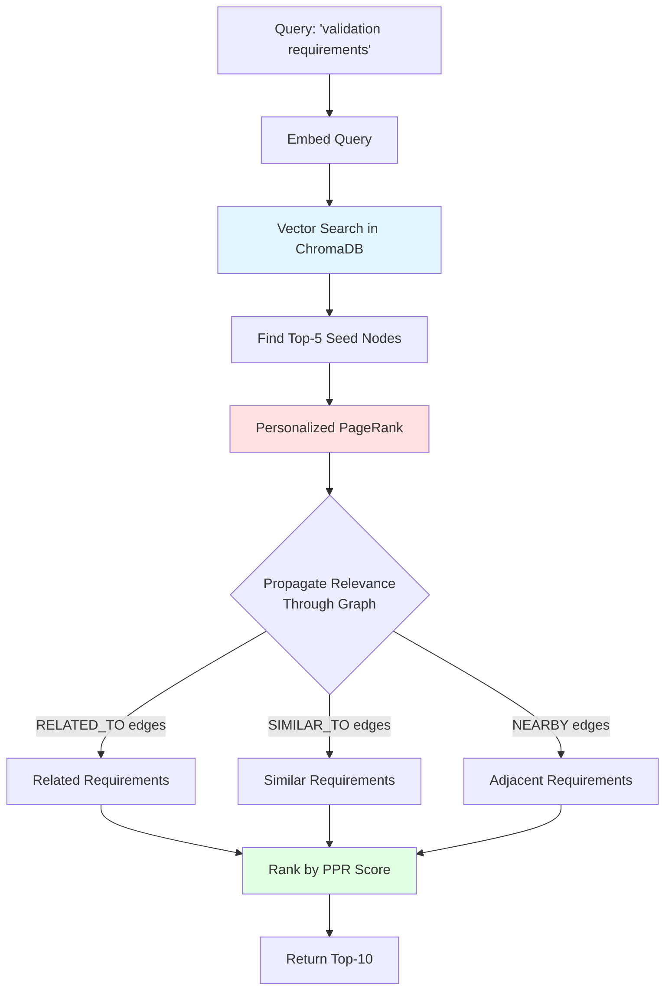

# Clinical Trial Compliance Checker with HippoRAG

FastAPI backend that checks clinical trial protocols for regulatory compliance using **Knowledge Graphs** and **HippoRAG** (NeurIPS 2024) retrieval.

## 🎯 Problem

When FDA/EMA regulations change, pharma companies waste **130-160 days** manually checking which trial protocols are affected. Each day costs **$6M** = **$780M-$960M** lost.

**Our Solution:** Automated compliance checking using AI agents + knowledge graphs in **< 10 seconds**.

---

## 🏗️ System Architecture



---

## 🕸️ Knowledge Graph Structure

### **3 Edge Types:**



**Legend:**
- **RELATED_TO** (dotted): LLM-found semantic relationships
- **SIMILAR_TO** (thick): Vector embedding similarity > 0.75
- **NEARBY** (thin): Sequential document connections

---

## 📊 Data Flow



---

## 🚀 Quick Start

### **1. Install Dependencies**

```bash
cd backend-fastapi

# With Poetry
poetry install
poetry shell

# Or with pip
python3 -m venv venv
source venv/bin/activate
pip install fastapi uvicorn pydantic pydantic-settings python-dotenv \
    httpx chromadb networkx pypdf sentence-transformers numpy scikit-learn
```

### **2. Configure Environment**

```bash
# Create .env file
cat > .env << 'EOF'
OPENROUTER_API_KEY=sk-or-v1-your-key-here
OPENROUTER_MODEL=anthropic/claude-3.5-sonnet
DEBUG=True
EOF
```

### **3. Run Test**

```bash
# Test with sample data (no PDF needed)
python test_regulation.py
```

**Expected Output:**
```
✓ Extracted 15 clauses
✓ Generated embeddings (dim=384)
✓ Extracted 12 triplets
✓ Graph built: 15 nodes, 44 edges
✓ Found 5 results (< 1 second)
```

### **4. Start API Server**

```bash
uvicorn app.main:app --reload
```

Open: http://localhost:8000/api/docs

---

## 🔍 HippoRAG Retrieval Algorithm



### **Why HippoRAG > Traditional RAG:**

| Method | Finds |
|--------|-------|
| **Vector Search Only** | Requirements with similar keywords |
| **HippoRAG (Graph + Vector)** | ✅ Similar keywords<br/>✅ Related concepts (different keywords)<br/>✅ Dependencies<br/>✅ Sequential context |

**Example:**
- Query: "electronic data validation"
- Vector finds: "Systems must be validated" ✅
- HippoRAG also finds: "Audit trails required" ✅ (connected via graph, different keywords!)

---

## 🎯 API Endpoints

### **Upload Regulation**

```bash
POST /api/regulations/upload
```

```bash
curl -X POST "http://localhost:8000/api/regulations/upload" \
  -F "file=@fda_regulation.pdf" \
  -F "country=USA" \
  -F "authority=FDA" \
  -F "title=21 CFR Part 11" \
  -F "version=2024"
```

**Response:**
```json
{
  "regulation_id": "FDA-2024",
  "num_clauses": 25,
  "graph_stats": {
    "num_nodes": 25,
    "num_edges": 87,
    "edge_types": {
      "RELATED_TO": 12,
      "SIMILAR_TO": 45,
      "NEARBY": 30
    }
  }
}
```

### **Query with HippoRAG**

```bash
POST /api/regulations/retrieve
```

```bash
curl -X POST "http://localhost:8000/api/regulations/retrieve" \
  -H "Content-Type: application/json" \
  -d '{
    "query_text": "Electronic data capture with validation",
    "country": "USA",
    "top_k": 5
  }'
```

**Response:**
```json
{
  "query": "Electronic data capture with validation",
  "results": [
    {
      "clause_id": "FDA-CHUNK0-REQ-002",
      "text": "Systems must be validated to ensure accuracy...",
      "ppr_score": 0.042,
      "section": "validation",
      "severity": "critical"
    }
  ],
  "num_results": 5
}
```

---

## 📁 Project Structure

```
backend-fastapi/
├── app/
│   ├── main.py                 # FastAPI entry point
│   ├── agents/
│   │   ├── openrouter_agent.py # LLM agent wrapper
│   │   └── prompts/            # Agent prompts
│   ├── api/
│   │   └── routes/
│   │       └── regulations.py  # API endpoints
│   ├── chroma/
│   │   └── client.py           # ChromaDB client
│   ├── graph/
│   │   └── graph_builder.py    # NetworkX graph + PPR
│   ├── models/
│   │   └── regulation.py       # Data models
│   └── services/
│       └── regulation_service.py # Main processing pipeline
├── data/
│   ├── chroma/                 # Vector DB (persistent)
│   └── graphs/                 # Saved graphs (JSON)
├── test_regulation.py          # Test script
└── pyproject.toml              # Dependencies
```

---

## 🧠 How It Works

### **Step 1: Extract Requirements (Agent)**

```python
# Prompt to LLM
"""
Extract REQUIREMENTS from this messy regulation text.
No structure assumed - pure semantic extraction.

Return JSON:
[
  {"id": "REQ-001", "text": "Systems must be validated",
   "topic": "validation", "severity": "critical"},
  ...
]
"""
```

### **Step 2: Find Relationships (Agent)**

```python
# Prompt to LLM
"""
Analyze requirements and find which are RELATED:
- Similar topics
- Work together for compliance
- Depend on each other

Return JSON:
[
  {"subject": "REQ-001", "predicate": "RELATED_TO",
   "object": "REQ-005", "confidence": 0.85},
  ...
]
"""
```

### **Step 3: Compute Embeddings**

```python
embeddings = sentence_transformer.encode(requirements)
# Each requirement → 384-dim vector
```

### **Step 4: Build Knowledge Graph**

```python
# Add nodes
for req in requirements:
    graph.add_node(req.id, text=req.text, ...)

# Add 3 edge types:
# 1. LLM edges (RELATED_TO)
for triplet in agent_triplets:
    graph.add_edge(triplet.subject, triplet.object)

# 2. Semantic similarity (SIMILAR_TO)
similarity_matrix = cosine_similarity(embeddings)
for i, j in high_similarity_pairs:
    graph.add_edge(req_i, req_j, relation="SIMILAR_TO")

# 3. Sequential (NEARBY)
for i in range(len(requirements) - 1):
    graph.add_edge(req[i], req[i+1], relation="NEARBY")
```

### **Step 5: HippoRAG Retrieval**

```python
# Vector search (seeds)
query_embedding = embed(query)
seeds = chroma.query(query_embedding, top_k=5)

# Personalized PageRank
ppr_scores = nx.pagerank(graph, personalization={
    seed: 1/len(seeds) for seed in seeds
})

# Return top-K by PPR score
results = sorted(ppr_scores.items(), key=lambda x: x[1], reverse=True)[:10]
```

---

## 🎪 Demo Use Case

**Scenario:** FDA updates validation requirements

1. **Upload new FDA regulation**
   - System extracts 25 requirements
   - Builds graph with 87 edges
   - Takes ~30 seconds

2. **Query impact**
   ```
   Query: "Which requirements about electronic data validation?"
   ```
   
3. **HippoRAG finds:**
   - ✅ Direct matches: "Systems must be validated"
   - ✅ Related (via graph): "Audit trails required"
   - ✅ Dependencies: "Documentation procedures needed"
   - ✅ Sequential: "Training on validation processes"

4. **Result:** Comprehensive list in < 1 second

---

## 📊 Performance

| Metric | Value |
|--------|-------|
| **Regulation Upload** | 20-30 seconds |
| **Requirements Extracted** | 10-20 per chunk |
| **Graph Build Time** | < 1 second |
| **Query Time (HippoRAG)** | < 1 second |
| **Embedding Model** | all-MiniLM-L6-v2 (384-dim) |
| **Graph Edges** | ~80-100 for 20 requirements |

---

## 🔧 Tech Stack

- **FastAPI** - API framework
- **OpenRouter** - LLM API (Claude 3.5 Sonnet)
- **ChromaDB** - Vector database
- **NetworkX** - Graph operations + PageRank
- **sentence-transformers** - Local embeddings
- **pypdf** - PDF text extraction
- **scikit-learn** - Cosine similarity

---

## 🚧 Future Enhancements

- [ ] Multi-protocol compliance checking
- [ ] Protocol → Regulation matching (reverse)
- [ ] Conflict detection between regulations
- [ ] Timeline tracking (regulation version history)
- [ ] Export to visual graph (D3.js, Cytoscape)
- [ ] OCR for scanned PDFs (Tesseract)

---

## 📚 References

- **HippoRAG** - [NeurIPS 2024 Paper](https://arxiv.org/abs/2405.14831)
- **Knowledge Graphs** - Neo4j, NetworkX
- **RAG** - Retrieval Augmented Generation

---

## 🤝 Contributing

Built for **CalHacks 11.0 - Rox Track Prize**

Focus: AI agents on messy, unstructured clinical trial data

---

## 📝 License

MIT

---

**Questions?** Check the test script or API docs at `/api/docs`
