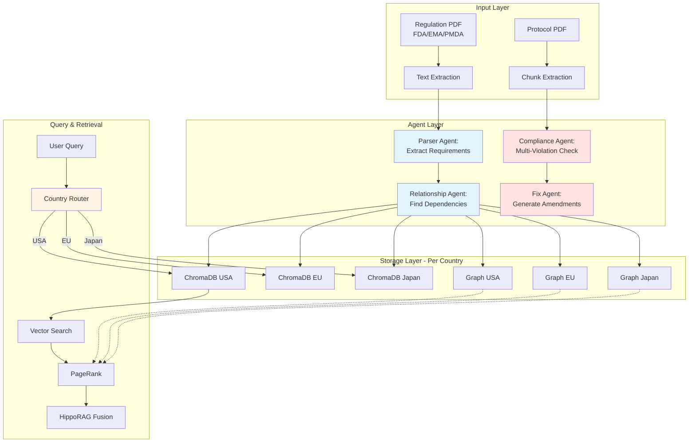
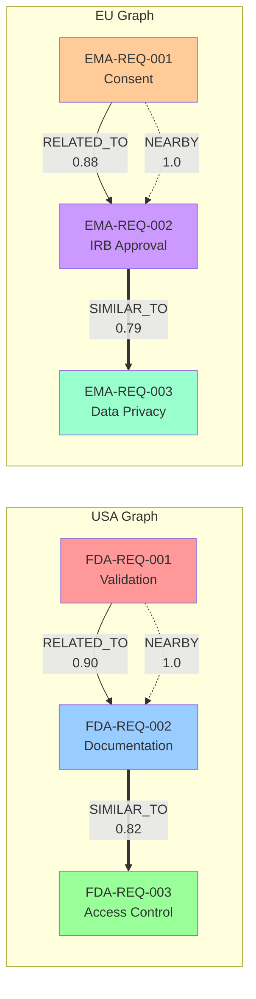
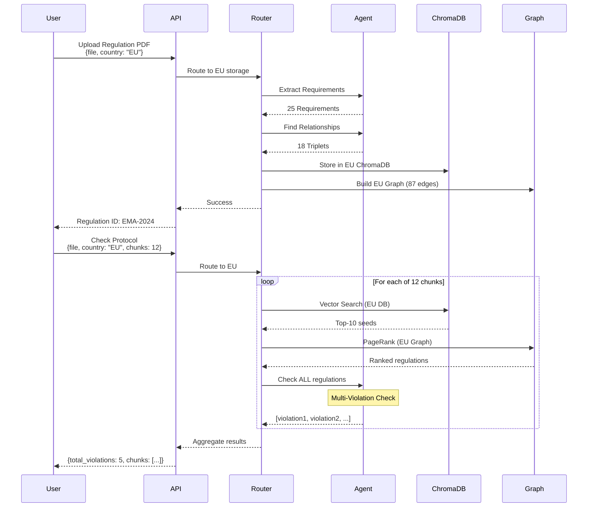

# Harmoniq Backend - Clinical Trial Compliance API

FastAPI backend that checks clinical trial protocols for regulatory compliance using **Knowledge Graphs**, **HippoRAG** (NeurIPS 2024), and **Multi-Jurisdiction Support**.

---

## 🎯 Problem

When FDA/EMA/PMDA regulations change, pharma companies waste **130-160 days** manually checking which trial protocols are affected across multiple jurisdictions. Each day costs **$6M** = **$780M-$960M** lost.

**Our Solution:** Automated multi-jurisdiction compliance checking using AI agents + knowledge graphs in **< 15 seconds**.

---

## 🌍 Multi-Jurisdiction Architecture

### Country-Specific Routing

Each regulatory authority has **dedicated storage**:

```
data/
├── usa/
│   ├── chroma/          # FDA regulations vector DB
│   └── graphs/          # FDA knowledge graphs
├── eu/
│   ├── chroma/          # EMA regulations vector DB
│   └── graphs/          # EMA knowledge graphs
└── japan/
    ├── chroma/          # PMDA regulations vector DB
    └── graphs/          # PMDA knowledge graphs
```

**API automatically routes** based on `country` parameter:
- `USA` → `data/usa/`
- `EU` → `data/eu/`
- `JAPAN` → `data/japan/`

---

## 🏗️ System Architecture



---

## ⚡ Key Features

### 1. **Multi-Jurisdiction Support**
- ✅ USA (FDA)
- ✅ Europe (EMA)
- ✅ Japan (PMDA)
- Isolated ChromaDB instances per country
- Separate knowledge graphs per jurisdiction
- Automatic routing based on `country` parameter

### 2. **Multi-Violation Detection**
- ✅ **Each chunk can have 0, 1, or MULTIPLE violations**
- Agent checks ALL regulations independently
- Doesn't stop after finding first violation
- Reports comprehensive violation list per chunk

### 3. **Automated Fix Generation**
- ✅ Generates targeted diffs for **ALL violations**
- 1-2 changes per violation
- Each change labeled with violation it addresses
- Prioritizes critical violations first

### 4. **HippoRAG Retrieval**
- Combines vector search + graph propagation
- Finds indirect relationships
- Better recall than traditional RAG

### 5. **Docker Support**
- Production-ready Dockerfile
- Docker Compose orchestration
- Health checks included
- Volume mounting for data persistence

---

## 🕸️ Knowledge Graph Structure

### **3 Edge Types Per Country:**



**Edge Types:**
- **RELATED_TO** (solid): LLM-found semantic relationships
- **SIMILAR_TO** (thick): Vector embedding similarity > 0.75
- **NEARBY** (dotted): Sequential document connections

---

## 📊 Data Flow



---

## 🚀 Quick Start

### Option 1: Docker (Recommended)

```bash
cd backend-fastapi

# Create .env file
echo "LAVA_API_KEY=your_key_here" > .env

# Start with Docker Compose
docker-compose up -d

# View logs
docker-compose logs -f backend

# Test
curl http://localhost:8000/api/regulations/test
```

### Option 2: Manual Setup

```bash
cd backend-fastapi

# With Poetry
poetry install
poetry shell

# Or with pip
python3 -m venv venv
source venv/bin/activate
pip install -r requirements.txt

# Configure
cp .env.example .env
# Add your LAVA_API_KEY

# Run
uvicorn app.main:app --reload --host 0.0.0.0 --port 8000
```

API available at: `http://localhost:8000`  
Interactive docs: `http://localhost:8000/docs`

---

## 🔍 API Endpoints

### 1. **Upload Regulation** (Country-Specific)

```bash
POST /api/regulations/upload
```

```bash
curl -X POST "http://localhost:8000/api/regulations/upload" \
  -F "file=@regulation.pdf" \
  -F "country=EU" \
  -F "authority=EMA" \
  -F "title=Clinical Trials Regulation" \
  -F "version=2024"
```

**Response:**
```json
{
  "regulation_id": "EMA-2024",
  "title": "Clinical Trials Regulation",
  "num_clauses": 25,
  "graph_stats": {
    "num_nodes": 25,
    "num_edges": 87,
    "edge_types": {
      "RELATED_TO": 12,
      "SIMILAR_TO": 45,
      "NEARBY": 30
    }
  }
}
```

### 2. **Check PDF Compliance** (Multi-Chunk + Multi-Violation)

```bash
POST /api/regulations/check-pdf-compliance
```

```bash
curl -X POST "http://localhost:8000/api/regulations/check-pdf-compliance" \
  -F "file=@protocol.pdf" \
  -F "country=EU" \
  -F "num_chunks=12" \
  -F "top_k=10"
```

**Response:**
```json
{
  "filename": "protocol.pdf",
  "total_chunks": 12,
  "processed_chunks": 12,
  "overall_compliance_score": 0.783,
  "overall_status": "NON_COMPLIANT",
  "total_violations": 5,
  "critical_violations": 2,
  "chunk_results": [
    {
      "chunk_index": 0,
      "chunk_text": "Participants will be informed...",
      "total_regulations_checked": 10,
      "compliant_count": 8,
      "non_compliant_count": 2,
      "compliance_score": 0.800,
      "status": "NON_COMPLIANT",
      "violations": [
        {
          "regulation_id": "EMA-CHUNK40-REQ-001",
          "is_related": true,
          "is_compliant": false,
          "non_compliance_probability": 0.92,
          "severity": "critical",
          "explanation": "Protocol missing informed consent elements required by EU CTR Article 29",
          "missing_elements": ["risks", "benefits", "withdrawal rights"]
        },
        {
          "regulation_id": "EMA-CHUNK96-REQ-002",
          "is_related": true,
          "is_compliant": false,
          "non_compliance_probability": 0.88,
          "severity": "high",
          "explanation": "No timeline specified for IRB approval process"
        }
      ]
    }
  ],
  "processing_time_seconds": 12.45
}
```

### 3. **Fix PDF Violations** (Multi-Violation Fixes)

```bash
POST /api/regulations/fix-pdf-violations
```

```bash
curl -X POST "http://localhost:8000/api/regulations/fix-pdf-violations" \
  -F "file=@protocol.pdf" \
  -F "country=EU" \
  -F "compliance_results=@results.json"
```

**Response:**
```json
{
  "changes": [
    {
      "type": "replace",
      "original": "Participants will be informed about the study",
      "replacement": "Participants will receive written informed consent including study purpose, all known risks and benefits, and explicit rights to withdraw at any time",
      "reason": "VIOLATION 1: Missing §29 required consent elements (risks, benefits, withdrawal rights)",
      "addresses_violation": 1
    },
    {
      "type": "add",
      "after": "Ethics committee review will be conducted",
      "content": " and approval obtained within 60 days prior to first participant enrollment",
      "reason": "VIOLATION 2: Missing timeline requirement per EU CTR Article 8",
      "addresses_violation": 2
    }
  ],
  "original_filename": "protocol.pdf",
  "total_changes": 2,
  "processing_time": 4.2,
  "chunks_processed": 12
}
```

### 4. **Query Knowledge Graph** (Country-Specific)

```bash
GET /api/regulations/graph/data?country=USA
```

```bash
curl "http://localhost:8000/api/regulations/graph/data?country=EU"
```

**Response:**
```json
{
  "nodes": [
    {
      "id": "EMA-CHUNK40-REQ-001",
      "type": "clause",
      "text": "Informed consent must include...",
      "section": "Article 29",
      "severity": "critical"
    }
  ],
  "edges": [
    {
      "source": "EMA-CHUNK40-REQ-001",
      "target": "EMA-CHUNK96-REQ-002",
      "relation": "RELATED_TO",
      "confidence": 0.88
    }
  ],
  "stats": {
    "num_nodes": 250,
    "num_edges": 612
  }
}
```

### 5. **Retrieve Regulations** (HippoRAG)

```bash
POST /api/regulations/retrieve
```

```bash
curl -X POST "http://localhost:8000/api/regulations/retrieve" \
  -H "Content-Type: application/json" \
  -d '{
    "query_text": "informed consent requirements",
    "country": "EU",
    "top_k": 5
  }'
```

---

## 📁 Project Structure

```
backend-fastapi/
├── app/
│   ├── main.py                    # FastAPI entry point
│   ├── agents/
│   │   ├── lava_agent.py          # LLM agent wrapper
│   │   ├── compliance_agent.py    # Multi-violation checker
│   │   ├── violation_fix_agent.py # Automated fix generator
│   │   └── prompts/               # Agent prompts
│   ├── api/
│   │   └── routes/
│   │       └── regulations.py     # API endpoints (country routing)
│   ├── chroma/
│   │   └── client.py              # ChromaDB client (per country)
│   ├── graph/
│   │   └── graph_builder.py       # NetworkX graph + PPR
│   ├── models/
│   │   └── regulation.py          # Data models
│   └── services/
│       └── regulation_service.py  # Country-specific processing
├── data/
│   ├── usa/
│   │   ├── chroma/                # FDA vector DB
│   │   └── graphs/                # FDA graphs
│   ├── eu/
│   │   ├── chroma/                # EMA vector DB
│   │   └── graphs/                # EMA graphs
│   └── japan/
│       ├── chroma/                # PMDA vector DB
│       └── graphs/                # PMDA graphs
├── Dockerfile                     # Production Docker image
├── docker-compose.yml             # Orchestration
├── .dockerignore                  # Docker build exclusions
├── README.Docker.md               # Docker deployment guide
└── pyproject.toml                 # Dependencies
```

---

## 🧠 How It Works

### Step 1: Multi-Jurisdiction Ingestion

```python
# Agent extracts requirements with country context
service = RegulationService(country="eu")  # Routes to data/eu/

# Extract + embed + store in EU-specific ChromaDB
clauses = await service.parse_regulation_with_agent(text, "EU", "EMA")

# Build EU-specific knowledge graph
service.build_knowledge_graph(reg_doc, triplets)

# Save to data/eu/graphs/EMA-2024.json
service.graph_builder.save("data/eu/graphs/EMA-2024.json")
```

### Step 2: Multi-Violation Detection

```python
# Compliance agent prompt explicitly states:
"""
⚠️ IMPORTANT: A SINGLE PROTOCOL PARAGRAPH CAN VIOLATE MULTIPLE REGULATIONS ⚠️
- Check EVERY regulation independently
- Report ALL violations found (not just the first one)
- Each protocol chunk may have 0, 1, or MULTIPLE violations
- Do NOT stop after finding one violation - continue checking all regulations
"""

# Agent returns array with one entry per regulation:
[
  {"regulation_id": "EMA-001", "is_compliant": false, ...},
  {"regulation_id": "EMA-002", "is_compliant": false, ...},
  {"regulation_id": "EMA-003", "is_compliant": true, ...}
]
```

### Step 3: Targeted Fix Generation

```python
# Fix agent prompt shows total violation count:
"""
⚠️ IMPORTANT: THIS TEXT CHUNK HAS {len(violations)} VIOLATIONS TO FIX ⚠️
- Address ALL {len(violations)} violations in your response
- Generate 1-2 changes per violation
- Label each change with which violation it addresses
"""

# Returns changes for ALL violations:
[
  {"type": "replace", "reason": "VIOLATION 1: ...", "addresses_violation": 1},
  {"type": "add", "reason": "VIOLATION 2: ...", "addresses_violation": 2},
  {"type": "replace", "reason": "VIOLATION 3: ...", "addresses_violation": 3}
]
```

---

## 📊 Performance Metrics

| Metric | Value |
|--------|-------|
| **Regulation Upload** | 20-30 seconds per PDF |
| **Requirements Extracted** | 10-20 per 1500-char chunk |
| **Graph Build Time** | < 1 second |
| **Query Time (HippoRAG)** | < 500ms |
| **Compliance Check (single chunk)** | 3-5 seconds |
| **Full PDF Check (12 chunks)** | 12-15 seconds (parallel) |
| **Jurisdictions Supported** | 3 (USA, EU, Japan) |
| **Total Regulations** | 600+ across all countries |
| **Total Graph Edges** | 1500+ across all countries |

---

## 🔧 Configuration

### Environment Variables

```bash
# .env file
LAVA_API_KEY=your_lava_api_key_here
ANTHROPIC_MODEL=claude-3-5-sonnet-20240620
ANTHROPIC_VERSION=2023-06-01
HOST=0.0.0.0
PORT=8000
WORKERS=4
DEBUG=False
```

### Docker Configuration

See `README.Docker.md` for complete Docker deployment guide including:
- Multi-stage builds
- Health checks
- Volume mounting
- Production deployment
- Docker Compose orchestration

---

## 🚧 Future Enhancements

- [ ] Additional jurisdictions (Health Canada, Australia TGA)
- [ ] Regulation version tracking and change detection
- [ ] Conflict detection between different jurisdictions
- [ ] Batch protocol processing
- [ ] WebSocket support for real-time progress
- [ ] Advanced caching for frequently checked protocols
- [ ] GraphQL API option
- [ ] Regulation recommendation engine

---

## 📚 Tech Stack

- **FastAPI** - Modern async API framework
- **LavaLabs** - LLM API (Anthropic Claude 3.5 Sonnet)
- **ChromaDB** - Vector database (per country instance)
- **NetworkX** - Graph operations + Personalized PageRank
- **sentence-transformers** - Local embeddings (all-MiniLM-L6-v2)
- **PyMuPDF** - PDF text extraction
- **scikit-learn** - Cosine similarity calculations
- **asyncio** - Concurrent chunk processing
- **Docker** - Containerized deployment

---

## 🤝 Contributing

Contributions welcome! Focus areas:
- Additional jurisdiction support
- Performance optimizations
- Enhanced agent prompts
- Graph visualization improvements
- Alternative embedding models

---

## 📝 License

MIT License

---

## 📧 Support

For questions or issues:
- Check `/docs` endpoint for interactive API documentation
- See `README.Docker.md` for deployment help
- Review agent prompts in `app/agents/prompts/`

---

**Built for clinical research teams navigating complex global regulations.**
